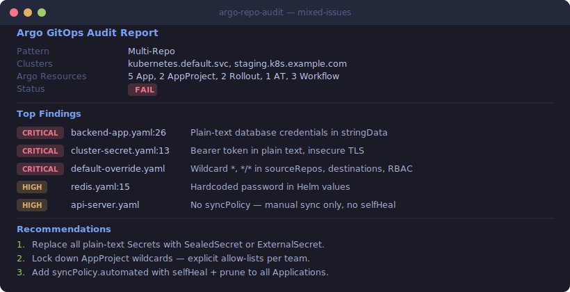
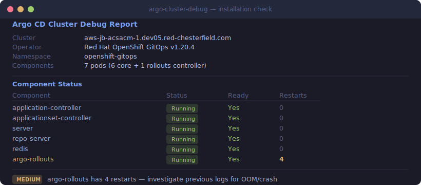
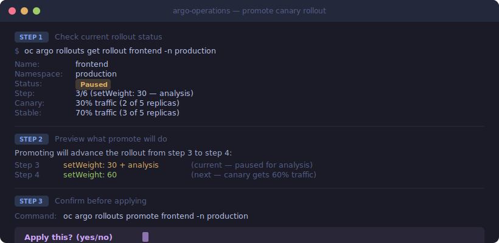
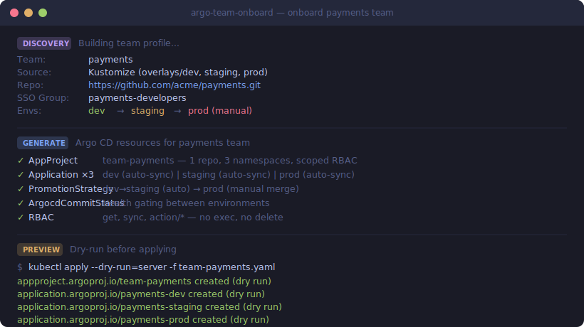

<p align="center">
  
</p>

<p align="center">
  <a href="LICENSE"></a>
  <a href="CONTRIBUTING.md"></a>
  
  
  
</p>

<p align="center">
  <b>Give your AI agent deep expertise in Argo CD, Rollouts, Workflows, and Events.</b><br>
  Generate manifests, audit repos, debug clusters, and manage operations — all from your terminal.
</p>

---

<details>
<summary><b>Quick Start</b></summary>

```shell
# Claude Code
/plugin marketplace add alimobrem/argo-skills
/plugin install argo-skills@argocd

# Then try:
# "Audit the current repo for GitOps best practices"
# "Check if Argo CD is healthy on my cluster"
# "Generate an ApplicationSet with git directory generator"
```

</details>

## Install

<details>
<summary><b>Claude Code</b></summary>

```shell
/plugin marketplace add alimobrem/argo-skills
/plugin install argo-skills@argocd
```

After install, the `argocd` agent appears in `/agents` and the 4 skills auto-trigger
based on context. Run `/reload-plugins` if they don't appear immediately.

</details>

<details>
<summary><b>Codex</b></summary>

Add to `$REPO_ROOT/.agents/plugins/marketplace.json` or `~/.agents/plugins/marketplace.json`:

```json
{
  "name": "argo-skills",
  "category": "Developer Tools",
  "source": {
    "source": "url",
    "url": "https://github.com/alimobrem/argo-skills.git",
    "ref": "main"
  },
  "policy": {
    "installation": "AVAILABLE",
    "authentication": "ON_INSTALL"
  }
}
```

</details>

<details>
<summary><b>GitHub Copilot</b></summary>

Copy the agent file to your repository:

```shell
mkdir -p .github/copilot
cp agents/github-copilot/argocd.agent.md .github/copilot/
```

</details>

<details>
<summary><b>Prerequisites</b></summary>

Required:
- `kubectl` or `oc` for Kubernetes/OpenShift cluster interaction

Optional (enhances capabilities):
- `kustomize` — Kustomize overlay builds
- `kubeconform` — schema validation against Argo CRDs
- `yq` — YAML parsing
- `argocd` — richer Application debugging and sync operations
- `argo` — Workflow inspection
- `kubectl-argo-rollouts` — Rollout status and promotion

Install all on macOS:
```shell
brew bundle
```

</details>

## Usage Guide

> **Full guide with all example prompts:** [docs/USER_GUIDE.md](docs/USER_GUIDE.md)

### How the Skills Work Together

The agent automatically selects the right skill based on what you ask:

```
 Ask a question ──────────► argo-knowledge    "How do I..."
 Audit a repo ────────────► argo-repo-audit   "Audit this repo"
 Debug a cluster ─────────► argo-cluster-debug "Why is X failing?"
 Make a change ───────────► argo-operations    "Install/create/promote/upgrade..."
 Onboard a team ──────────► argo-team-onboard  "Set up a new team on Argo CD"
```

You don't need to invoke skills manually — just describe what you need.

### Knowledge — Ask Questions & Generate YAML

Use when you need to understand Argo concepts or generate manifests.

```text
# Generate manifests
Generate a multi-source Application that combines a Helm chart from
oci://registry.example.com/myapp with values from a Git repo.

# Architecture guidance
What's the best way to structure a multi-cluster GitOps repo?
Should I use app-of-apps or ApplicationSet?

# Newer features
How do I set up argocd-agent for 200 edge clusters behind firewalls?
How do I run Applications in any namespace for multi-tenancy?

# OpenShift-specific
Generate an ArgoCD CR for the OpenShift GitOps operator with OAuth and Routes.
```

<details>
<summary>Reference docs included</summary>

| Topic | Reference |
|-------|-----------|
| Application spec, sync policies, health checks, multi-cluster | `applications.md` |
| ApplicationSet generators, progressive syncs, templates | `applicationsets.md` |
| AppProject RBAC, source/destination restrictions, sync windows | `app-projects.md` |
| Rollout canary/blue-green, traffic management, AnalysisTemplate | `rollouts.md` |
| Workflow DAG/steps, parameters, artifacts, CronWorkflow | `workflows.md` |
| EventSource types, EventBus, Sensor triggers, filters | `events.md` |
| Notification services, templates, triggers, subscriptions | `notifications.md` |
| Image updater annotations, strategies, write-back | `image-updater.md` |
| Repository patterns (app-of-apps, ApplicationSet, monorepo) | `repo-patterns.md` |
| Best practices (sync, RBAC, health, secrets) | `best-practices.md` |
| argocd-agent hub-and-spoke architecture | `agent-mode.md` |
| Multi-tenancy, apps-in-any-namespace, Autopilot | `multi-tenancy.md` |
| OpenShift GitOps Operator, ArgoCD CRD, Routes, SCCs, OAuth | `openshift.md` |

</details>

### Repo Audit — Security & Best Practice Review

<p align="center">
  
</p>

Use when you want to validate a GitOps repo before deploying or during a review.

```text
# Full audit
Audit the current repo and provide a GitOps report.

# Targeted checks
Check for security issues in my AppProject configurations.
Are there any hardcoded secrets in Helm values?
Do my Applications have proper sync retry configuration?

# Validation only
Just validate YAML syntax and schemas, don't do a full audit.
```

**What it catches:**

| Severity | Examples |
|----------|---------|
| Critical | Wildcard `*` in AppProject sourceRepos/destinations, plain-text Secrets, hardcoded passwords in Helm values, `clusterResourceWhitelist: */*` |
| Warning | Missing syncPolicy, `targetRevision: HEAD` in production, no retry/backoff, missing `activeDeadlineSeconds` on Workflows |
| Info | Missing `ignoreDifferences` for HPA-managed replicas, no progressive sync on multi-cluster ApplicationSets |

### Cluster Debug — Troubleshoot Live Issues

<p align="center">
  
</p>

Use when something is broken or you want a health check.

```text
# Health check
Check if Argo CD is properly installed on my cluster.

# Application issues
Why is my Application podinfo stuck in OutOfSync?
Debug the degraded Application in the production namespace.

# Rollout issues
The canary rollout for frontend is stuck at step 2. Why?
Are my AnalysisTemplates actually testing anything meaningful?

# Multi-tenant review
Compare all ArgoCD instances on this cluster and check for security gaps.

# Deep investigation
Inspect all Rollouts on this cluster and give me a health report.
Review the Argo CD configuration for security concerns.
```

### Operations — Install, Deploy, Promote, Maintain

<p align="center">
  
</p>

Use when you want to make changes. Every write follows a safety model:
**Generate** YAML → **Preview** with dry-run → **Confirm** before applying.

```text
# Setup
Install Argo CD on my OpenShift cluster using the GitOps operator.
Create an AppProject for the frontend team with restricted access.
Add the staging cluster to Argo CD.

# Deploy
Create an Application for my Helm chart with automated sync.
Create an ApplicationSet with git directory generator and progressive syncs.
Set up Slack notifications for sync failures.

# Promote
Promote the canary rollout frontend in production.
Sync the Application with server-side apply.
Abort the failing rollout and retry.

# Maintain
Upgrade Argo CD to the latest version.
Back up all my Applications and AppProjects to YAML files.
Rotate the Git credentials for the infra repo.
```

<details>
<summary>Safety model details</summary>

| Step | What happens |
|------|-------------|
| Generate | Produces YAML manifest or CLI command, shows it in a code block |
| Preview | Runs `--dry-run=client`, `kubectl diff`, or `argocd app diff` to show what changes |
| Confirm | Asks "Apply this? (yes/no)" — does NOT proceed without explicit approval |

Read-only operations (backup, status checks) skip confirmation.

Destructive operations (delete, prune, rollback) require typing the resource name to confirm.

</details>

### Team Onboarding — Set Up New Teams on Argo CD

<p align="center">
  
</p>

Use when you need to onboard app teams onto Argo CD. The skill discovers what
each team already has (CI, registry, source type) and generates only the Argo CD
pieces — no assumptions about your stack.

```text
# Single team onboarding
Onboard the payments team. They use Kustomize, deploy from
https://github.com/acme/payments.git, need dev/staging/prod namespaces.

# Helm-based team
Onboard analytics — they deploy a Helm chart from OCI registry
oci://registry.acme.com/charts/analytics with values in a separate config repo.

# Self-service at scale
Set up self-service onboarding so teams can add themselves via PR.

# Multi-environment with promotion
Onboard the checkout team with gitops-promoter gating dev → staging → prod.
Production should require manual approval.
```

**What it generates:**

| Resource | When | Why |
|----------|------|-----|
| AppProject | Always | Security boundary — scoped sourceRepos, destinations, RBAC |
| Application | Always | Points to team's repo with correct source type (Helm/Kustomize/directory) |
| RBAC role | Always | Project-scoped permissions for team's SSO group |
| Namespace + Quota | If needed | When namespaces don't exist yet |
| PromotionStrategy | If multi-env | Branch-per-environment promotion with health gates |
| ApplicationSet | If self-service | teams.yaml + git-file generator for scaling |

**What it refuses:**

| Request | Response |
|---------|----------|
| `sourceRepos: '*'` | Lists repos explicitly — wildcards defeat multi-tenancy |
| `clusterResourceWhitelist: '*/*'` | Scopes to specific CRD groups needed |
| `exec` permission | Redirects to kubectl exec with scoped RBAC |
| Hardcoded secrets | References ExternalSecret or SealedSecret patterns |

<details>
<summary>Reference docs included</summary>

| Topic | Reference |
|-------|-----------|
| What gets created, AppProject/Application/RBAC templates, validation checklist | `onboarding-guide.md` |
| Self-service via ApplicationSet + teams.yaml, PR workflow, guard rails | `self-service-pattern.md` |
| Helm/Kustomize/directory variants, Rollouts, notifications, sync windows, promoter | `onboarding-variants.md` |

</details>

## Benchmarks

Evals test **outcomes** (issues found, report quality), not process (which tools were used).
Tested on real repos and a live OpenShift cluster.

<table>
<thead>
<tr>
<th width="200">Skill</th>
<th width="80">Score</th>
<th>Highlights</th>
</tr>
</thead>
<tbody>
<tr>
<td><a href="benchmarks/argo-knowledge.md"><b>argo-knowledge</b></a></td>
<td><b>98%</b><br><sub>vs 86% baseline</sub></td>
<td>+70% on argocd-agent, +17% on gitops-promoter, +8% on multi-tenant RBAC. Skill differentiates on newer features not saturated in training data.</td>
</tr>
<tr>
<td><a href="benchmarks/argo-repo-audit.md"><b>argo-repo-audit</b></a></td>
<td><b>100%</b></td>
<td>Catches all Critical issues: wildcard AppProjects, plain-text Secrets, hardcoded passwords, missing sync policies, HEAD revisions, weak AnalysisTemplates.</td>
</tr>
<tr>
<td><a href="benchmarks/argo-cluster-debug.md"><b>argo-cluster-debug</b></a></td>
<td><b>97.5%</b></td>
<td>Advanced evals on live OpenShift: multi-tenant ArgoCD audit, ApplicationSet deep dive, Rollout analysis (flagged trivial AnalysisTemplates), config review, sync wave ordering.</td>
</tr>
<tr>
<td><a href="benchmarks/argo-operations.md"><b>argo-operations</b></a></td>
<td><b>87%</b></td>
<td>Safety model fully compliant: dry-run preview + user confirmation on every write. Context-aware — detects existing installations and adapts.</td>
</tr>
<tr>
<td><a href="benchmarks/argo-team-onboard.md"><b>argo-team-onboard</b></a></td>
<td><b>100%</b><br><sub>27/27 scored</sub></td>
<td>Discovery-first onboarding. Refuses overprivileged requests. Branch-per-env promotion with gitops-promoter. Opus and Sonnet both 100%.</td>
</tr>
</tbody>
</table>

### Cross-Model: Sonnet with skill beats Opus without

<table>
<thead>
<tr>
<th width="250"></th>
<th width="120">Opus + Skill</th>
<th width="120">Opus Baseline</th>
<th width="120">Sonnet + Skill</th>
</tr>
</thead>
<tbody>
<tr>
<td><b>argo-knowledge</b> (8 evals)</td>
<td><b>98%</b></td>
<td>86%</td>
<td><b>95%</b></td>
</tr>
</tbody>
</table>

> **Sonnet + skill (95%) > Opus without skill (86%).**
> The skill effectively upgrades a cheaper, faster model to exceed the expensive model's
> baseline accuracy on Argo-specific tasks — a strong case for cost-conscious teams.

<sub>Run locally with <code>make eval</code> or via GitHub Actions (<code>evals</code> workflow).
Full results per model in <a href="benchmarks/">benchmarks/</a>.</sub>

## Contributing

Contributions are welcome! Please see [CONTRIBUTING.md](CONTRIBUTING.md) for guidelines.

<details>
<summary><b>Development</b></summary>

```shell
# Install prerequisites (macOS)
brew bundle

# Download Argo CRD schemas for validation
make download-schemas

# Run tests
make test-discover
make test-validate

# Run evals
make eval
```

See [AGENTS.md](AGENTS.md) for the repo layout, skill conventions, and eval runner instructions.

</details>

## Code of Conduct

This project follows the [Contributor Covenant Code of Conduct](CODE_OF_CONDUCT.md).

## Security

See [SECURITY.md](SECURITY.md) for reporting vulnerabilities.

## License

[MIT License](LICENSE)
